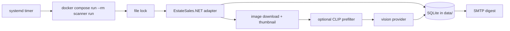

# Estate Sale Finder

Estate Sale Finder is a single-process Python batch app for a Linux home server. It runs once per day, finds EstateSales.NET estate and moving sales near ZIP `14221`, scans new sale photos for modern camera and golf equipment, persists all state in SQLite, and emails only newly found positive matches.



## Current EstateSales.NET Assumption

The ZIP, discovery, and hydration API endpoints were verified with live responses on June 30, 2026. A dependable full-gallery API endpoint was not found. The app uses a tested public HTML fallback parser that extracts `picturescdn.estatesales.net/<sale_id>/...` gallery URLs and raises `GalleryUnavailableError` when the page structure no longer exposes gallery metadata. It does not fabricate sequential image URLs and does not bypass authentication, CAPTCHA, or access controls.

## Local Setup

```bash
python3.12 -m venv .venv
. .venv/bin/activate
pip install -e '.[dev]'
cp .env.example .env
estate-sale-finder migrate
estate-sale-finder doctor
estate-sale-finder run --dry-run
```

If `uv` is available:

```bash
uv sync --extra dev
uv run estate-sale-finder run --dry-run
```

## Configuration

Configuration is loaded from environment variables and `.env`. Important defaults:

- `POSTAL_CODE=14221`
- `SEARCH_RADIUS_MILES=35`
- `LOOKAHEAD_DAYS=15`
- `MIN_PICTURE_COUNT=5`
- `ALLOWED_SALE_TYPES=EstateSales,MovingSales`
- `DATA_DIR=/app/data` in Docker
- `ANALYSIS_PROVIDER=mock` until OpenAI credentials are configured
- `EMAIL_ENABLED=false` until SMTP is configured

Set `ANALYSIS_PROVIDER=openai`, `VISION_API_KEY`, and `VISION_MODEL` to use the hosted vision provider. SMTP uses `SMTP_HOST`, `SMTP_PORT`, `SMTP_USERNAME`, `SMTP_PASSWORD`, `SMTP_USE_TLS`, `EMAIL_FROM`, and comma-separated `EMAIL_TO`.

Keep `.env` mode restrictive on the server:

```bash
chmod 600 .env
```

## Commands

```bash
estate-sale-finder run
estate-sale-finder run --dry-run
estate-sale-finder run --reanalyze
estate-sale-finder run --reanalyze-version-mismatch
estate-sale-finder run --sale-id 4975674
estate-sale-finder doctor
estate-sale-finder migrate
estate-sale-finder test-email
estate-sale-finder inspect-sale 4975674
```

## Deduplication And Rescans

Sales are unique by `source + external_id`. Images are unique by `sale_id + source_url`, with SHA-256 and perceptual hashes stored after download. A sale refreshes when `pictureCount`, `utcDateModified`, or `latestPicturesAddedCount` changes. An image is analyzed only when it has not been analyzed, `--reanalyze` is used, or `--reanalyze-version-mismatch` is used after changing `ANALYSIS_VERSION`.

Detections are marked emailed only after SMTP send succeeds. A failed email leaves detections eligible for the next run.

## Local Prefilter

`LOCAL_PREFILTER_ENABLED=false` by default. When enabled with the optional `prefilter` dependency, the app lazily loads `open-clip-torch` and caches model files under `XDG_CACHE_HOME` (`/app/model-cache` in Docker). The threshold is recall-oriented and must be tuned with saved scores in the database.

## Testing

Normal tests do not call EstateSales.NET, SMTP, OpenAI, or paid services.

```bash
ruff format .
ruff check .
mypy
pytest
```

Live smoke tests should be added only behind an explicit environment flag.

## Docker

Build and run locally:

```bash
docker build -t estate-sale-finder:local .
docker compose run --rm scanner run
```

Run the published image:

```bash
docker run --rm --env-file .env -v "$PWD/data:/app/data" -v "$PWD/model-cache:/app/model-cache" ghcr.io/tohutson/estate-sale-finder:latest run
```

The image runs as a non-root user and stores mutable state only in `/app/data` and `/app/model-cache`.

## GHCR Publishing

GitHub Actions runs Ruff, mypy, tests, builds with Buildx, and pushes:

- `ghcr.io/tohutson/estate-sale-finder:latest`
- `ghcr.io/tohutson/estate-sale-finder:<commit-sha>`
- semantic version tags such as `v1.2.3`

For a private GHCR package on the server:

```bash
echo "$GHCR_READ_TOKEN" | docker login ghcr.io -u tohutson --password-stdin
```

Use a minimally scoped package read token.

## Linux Server Deployment

Suggested directory:

```bash
sudo mkdir -p /opt/estate-sale-finder
sudo cp compose.yaml .env /opt/estate-sale-finder/
sudo mkdir -p /opt/estate-sale-finder/data /opt/estate-sale-finder/model-cache
sudo chmod 600 /opt/estate-sale-finder/.env
sudo cp deploy/systemd/*.service deploy/systemd/*.timer /etc/systemd/system/
sudo systemctl daemon-reload
sudo systemctl enable --now estate-sale-image-pull.timer
sudo systemctl enable --now estate-sale-scanner.timer
```

The image pull timer runs hourly. The scanner timer runs daily at 06:15 local time with `Persistent=true`, so missed runs execute after the server returns.

Manual server run:

```bash
cd /opt/estate-sale-finder
docker compose run --rm scanner run
```

## Backups

Stop active runs first, then back up:

```bash
sqlite3 data/estate-sale-finder.db '.backup backup/estate-sale-finder.db'
rsync -a data/thumbnails/ backup/thumbnails/
```

The SQLite DB contains run state and deduplication; thumbnails are needed for historical email context.

## Troubleshooting

- `doctor` fails ZIP lookup: EstateSales.NET may have changed or blocked the endpoint. Check outbound HTTPS and the adapter tests.
- Gallery unavailable: capture the current sale page HTML, add it under `tests/fixtures/`, update `extract_gallery_from_html`, and run parser tests.
- No email: verify `EMAIL_ENABLED=true`, SMTP settings, `EMAIL_TO`, and server outbound SMTP policy.
- Repeated detections: inspect `detections.included_in_email`; failed SMTP sends intentionally leave records unsent.
- Slow first prefilter run: model weights are downloading to `model-cache`.

## Security And Compliance

The app needs outbound HTTPS to EstateSales.NET, image CDNs, GHCR, and optionally OpenAI. It does not need inbound webhooks or SSH from GitHub, does not mount the Docker socket, and does not store secrets in the image. EstateSales.NET APIs are undocumented and may change; review their terms and your usage risk before relying on the scanner.
