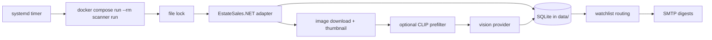

# Estate Sale Finder

Estate Sale Finder is a single-process Python batch app for a Linux home server. It runs on a shared systemd timer, finds EstateSales.NET estate and moving sales near ZIP `14221`, scans new sale photos for approved targets, persists all state in SQLite, and emails only newly found positive matches.

The application supports multiple watchlists. Each watchlist has a stable ID, display name, recipient emails, target categories, and email preferences. The scanner discovers sales and analyzes each image once using the superset of active watchlist categories, then routes detections to only the watchlists that include each category.

The approved target categories are:

- `golf_clubs`
- `golf_bag`
- `golf_balls`
- `modern_camera`
- `modern_camera_lens`
- `collectible_perfume_bottle`
- `jewelry`



## Current EstateSales.NET Assumption

The ZIP, discovery, and hydration API endpoints were verified with live responses on June 30, 2026. A dependable full-gallery API endpoint was not found. The app uses a tested public HTML fallback parser that extracts `picturescdn.estatesales.net/<sale_id>/...` gallery URLs and raises `GalleryUnavailableError` when the page structure no longer exposes gallery metadata. It does not fabricate sequential image URLs and does not bypass authentication, CAPTCHA, or access controls.

## Local Setup

```bash
python3.12 -m venv .venv
. .venv/bin/activate
pip install -e '.[dev]'
cp .env.example .env
estate-sale-finder migrate
estate-sale-finder doctor
estate-sale-finder run --dry-run
```

If `uv` is available:

```bash
uv sync --extra dev
uv run estate-sale-finder run --dry-run
```

## Configuration

Configuration is loaded from environment variables and `.env`. Important defaults:

- `POSTAL_CODE=14221`
- `SEARCH_RADIUS_MILES=35`
- `LOOKAHEAD_DAYS=15`
- `MIN_PICTURE_COUNT=5`
- `ALLOWED_SALE_TYPES=EstateSales,MovingSales`
- `DATA_DIR=/app/data` in Docker
- `ANALYSIS_VERSION=multi-watchlist-v1`
- `PROMPT_VERSION=targets-multi-v1`
- `ANALYSIS_PROVIDER=mock` until OpenAI credentials are configured
- `EMAIL_ENABLED=false` until SMTP is configured

Set `ANALYSIS_PROVIDER=openai`, `VISION_API_KEY`, and `VISION_MODEL` to use the hosted vision provider. SMTP uses shared sender settings: `SMTP_HOST`, `SMTP_PORT`, `SMTP_USERNAME`, `SMTP_PASSWORD`, `SMTP_USE_TLS`, and `EMAIL_FROM`.

Production watchlists are configured with JSON:

```bash
WATCHLIST_CONFIG_PATH=/app/config/watchlists.json
```

Example:

```json
{
  "watchlists": [
    {
      "id": "golf_camera",
      "name": "Golf and Camera Finds",
      "recipients": ["user@example.com"],
      "targets": [
        "golf_clubs",
        "golf_bag",
        "golf_balls",
        "modern_camera",
        "modern_camera_lens"
      ],
      "send_on_no_matches": false
    },
    {
      "id": "perfume_jewelry",
      "name": "Perfume and Jewelry Finds",
      "recipients": ["other@example.com"],
      "targets": ["collectible_perfume_bottle", "jewelry"],
      "send_on_no_matches": false
    }
  ]
}
```

If `WATCHLIST_CONFIG_PATH` is set, the file is authoritative. If it is not set, the app falls back to the legacy `EMAIL_TO` value and a default `golf_camera` watchlist containing the original golf/camera categories. Keep recipient emails in the server-side config private.

Vision analysis uses batch-local image references such as `img_0001`, not raw database IDs, at the provider boundary. Retry controls have safe defaults: `VISION_BATCH_SIZE=4`, `VISION_MAX_BATCH_ATTEMPTS=2`, `VISION_MAX_SINGLE_IMAGE_ATTEMPTS=2`, and `VISION_RETRY_BACKOFF_SECONDS=1`. Setting `VISION_BATCH_SIZE=1` is a conservative troubleshooting option for provider mapping issues, but normal production batching remains supported.

Use `VISION_MAX_IMAGES_PER_RUN` as a paid-call safety valve during diagnostics or backlog catch-up. For example, `VISION_MAX_IMAGES_PER_RUN=5` analyzes at most five eligible images in one run and leaves the rest for later idempotent runs. Leave it empty for no cap.

Set `OPENAI_SAVE_RESPONSES=true` to save raw OpenAI response snapshots under `DATA_DIR/logs/openai-responses` by default, or set `OPENAI_RESPONSE_LOG_DIR` to choose another directory. Snapshots include image references, status codes, request IDs, response bodies, and error bodies, but not the API key or base64 image request payload.

Keep `.env` mode restrictive on the server:

```bash
chmod 600 .env
```

## Commands

```bash
estate-sale-finder run
estate-sale-finder run --dry-run
estate-sale-finder run --reanalyze
estate-sale-finder run --reanalyze-version-mismatch
estate-sale-finder run --reanalyze-active
estate-sale-finder run --watchlist perfume_jewelry
estate-sale-finder backfill-watchlist perfume_jewelry --active-only
estate-sale-finder watchlists validate
estate-sale-finder watchlists list
estate-sale-finder run --sale-id 4975674
estate-sale-finder doctor
estate-sale-finder migrate
estate-sale-finder test-email
estate-sale-finder inspect-sale 4975674
```

## Deduplication And Rescans

Sales are unique by `source + external_id`. Images are unique by `sale_id + source_url`, with SHA-256 and perceptual hashes stored after download. A sale refreshes when `pictureCount`, `utcDateModified`, or `latestPicturesAddedCount` changes, and eligible sales with a failed or incomplete prior gallery scan are retried. Sales below `MIN_PICTURE_COUNT` are still persisted and reconsidered during later discovery runs.

An image is analyzed only when it has not been analyzed, `--reanalyze` is used, or a version-mismatch option is used after changing `ANALYSIS_VERSION`. Normal startup does not automatically reanalyze old images after a version change. After adding a new watchlist such as `perfume_jewelry`, run:

```bash
estate-sale-finder backfill-watchlist perfume_jewelry --active-only
```

This scans normally, then reanalyzes active sale images whose analysis version does not match the current version so current relevant images can be evaluated for the new categories without reprocessing the entire historical database.

Database records retain provider, model, prompt version, and analysis version.

Detections are marked sent in `detection_notifications` only after that watchlist recipient's SMTP send succeeds. The uniqueness key is detection ID, watchlist ID, and recipient email. A failed email to one recipient does not mark another recipient's detections, and the same detection can be sent to a different watchlist when that watchlist also includes the category. The legacy `detections.included_in_email` column is retained only for migration compatibility.

The process lock prevents overlapping runs. If a previous process was interrupted after recording a run as `running`, the next run marks that stale record failed after acquiring the lock.

## Local Prefilter

`LOCAL_PREFILTER_ENABLED=false` by default. The production Docker image includes the `prefilter` dependency set (`torch` and `open-clip-torch`) so the prefilter can run on the home server when enabled. The app lazily loads the model and caches model files under `XDG_CACHE_HOME` (`/app/model-cache` in Docker). The threshold is recall-oriented and must be tuned with saved scores in the database.

Each run logs `local_prefilter_complete` with `images_prefiltered`, `images_prefilter_passed`, and `images_prefilter_rejected`. The final `run_complete` log includes those counters plus `vision_batches_sent`, `vision_batches_succeeded`, `vision_batches_failed`, `vision_batches_attempted`, `vision_batches_retried`, `vision_batch_mapping_failures`, `images_retried_individually`, `images_analysis_succeeded`, and `images_analysis_failed`.

The local prefilter includes recall-oriented concepts for golf/camera targets plus collectible perfume bottles and jewelry. It is intentionally not a final classifier.

When `ANALYSIS_PROVIDER=openai`, the OpenAI provider logs `openai_vision_request_sent`, `openai_vision_request_succeeded`, and `openai_vision_request_failed` events. Successful request logs include the HTTP status code and OpenAI request ID when the API returns one.

### Vision response mapping failures

Every vision batch sends each thumbnail immediately after an immutable batch-local `image_ref`, and the provider must return exactly one result per supplied reference. The pipeline rejects missing, unexpected, duplicate, or extra references after structured-output validation. It deliberately refuses multi-image positional mapping because attaching detections to the wrong image is worse than retrying.

When a batch mapping or parse failure occurs, the run logs `vision_batch_mapping_failed` or `vision_batch_provider_failed` with provider, model, batch size, expected references, returned references when available, missing, unexpected, duplicate references, image IDs, sale IDs, attempt number, and retry strategy. Logs do not include API keys, authorization headers, SMTP credentials, image base64, or binary image data.

The retry policy is bounded. A failed configured batch is retried up to `VISION_MAX_BATCH_ATTEMPTS`; if it still fails and contains more than one image, the pipeline retries each image individually up to `VISION_MAX_SINGLE_IMAGE_ATTEMPTS`. One malformed image is marked `failed` with a bounded sanitized error and remains retryable in a later run. Successful images in the same original batch are persisted normally and are not repeated on the next idempotent run. A single-image response with one wrong or missing reference may be corrected only when unambiguous, and logs `vision_single_result_ref_corrected`.

Use `VISION_BATCH_SIZE=1` temporarily if you need to troubleshoot a provider that repeatedly returns malformed multi-image references. This is a fallback diagnostic mode, not a requirement for normal production operation. Partial success is represented in the run summary by nonzero `images_analysis_failed`; the CLI still exits `0` for isolated provider image failures, while configuration, database, discovery, and other fatal failures remain nonzero.

## Testing

Normal tests do not call EstateSales.NET, SMTP, OpenAI, or paid services.

```bash
ruff format --check .
ruff check .
mypy src
pytest
```

Live smoke tests should be added only behind an explicit environment flag.

## Docker

Build and run locally:

```bash
docker build -t estate-sale-finder:local .
docker compose run --rm scanner run
```

Run the published image:

```bash
docker run --rm --env-file .env -v "$PWD/data:/app/data" -v "$PWD/model-cache:/app/model-cache" -v "$PWD/config:/app/config:ro" ghcr.io/tohutson/estate-sale-finder:latest run
```

The image runs as a non-root user and stores mutable state only in `/app/data` and `/app/model-cache`. Watchlist config is mounted read-only at `/app/config`.

## GHCR Publishing

GitHub Actions runs Ruff, mypy, tests, builds with Buildx, and pushes:

- `ghcr.io/tohutson/estate-sale-finder:latest`
- `ghcr.io/tohutson/estate-sale-finder:<commit-sha>`
- semantic version tags such as `v1.2.3`

For a private GHCR package on the server:

```bash
echo "$GHCR_READ_TOKEN" | docker login ghcr.io -u tohutson --password-stdin
```

Use a minimally scoped package read token.

## Linux Server Deployment

Install Docker Engine and the Compose plugin using the official apt repository:

```bash
sudo apt-get update
sudo apt-get install -y ca-certificates curl
sudo install -m 0755 -d /etc/apt/keyrings
sudo curl -fsSL https://download.docker.com/linux/ubuntu/gpg -o /etc/apt/keyrings/docker.asc
sudo chmod a+r /etc/apt/keyrings/docker.asc
echo "deb [arch=$(dpkg --print-architecture) signed-by=/etc/apt/keyrings/docker.asc] https://download.docker.com/linux/ubuntu $(. /etc/os-release && echo "$VERSION_CODENAME") stable" | sudo tee /etc/apt/sources.list.d/docker.list >/dev/null
sudo apt-get update
sudo apt-get install -y docker-ce docker-ce-cli containerd.io docker-buildx-plugin docker-compose-plugin
sudo systemctl enable --now docker
```

Create the application directory and persistent state:

```bash
sudo mkdir -p /opt/estate-sale-finder
sudo mkdir -p /opt/estate-sale-finder/data /opt/estate-sale-finder/model-cache /opt/estate-sale-finder/config
sudo cp compose.yaml /opt/estate-sale-finder/
sudo cp .env.example /opt/estate-sale-finder/.env
sudo cp examples/watchlists.json /opt/estate-sale-finder/config/watchlists.json
sudo chmod 600 /opt/estate-sale-finder/.env
sudo chown -R "$USER":"$USER" /opt/estate-sale-finder
```

Edit `/opt/estate-sale-finder/.env` with the server ZIP code, OpenAI settings, SMTP settings, and `WATCHLIST_CONFIG_PATH=/app/config/watchlists.json`. Edit `/opt/estate-sale-finder/config/watchlists.json` with private recipient emails. Keep runtime secrets only in the server-side `.env`; treat watchlist config as private because it contains recipient addresses and preferences.

For a private GHCR package, log in with a read-only package token:

```bash
echo "$GHCR_READ_TOKEN" | docker login ghcr.io -u tohutson --password-stdin
```

Pull, migrate, check configuration, send a test email, and run one manual scan:

```bash
cd /opt/estate-sale-finder
docker compose pull scanner
docker compose run --rm scanner migrate
docker compose run --rm scanner doctor
docker compose run --rm scanner watchlists validate
docker compose run --rm scanner test-email
docker compose run --rm scanner backfill-watchlist perfume_jewelry --active-only
docker compose run --rm scanner run
```

Install and enable the timers:

```bash
sudo cp deploy/systemd/*.service deploy/systemd/*.timer /etc/systemd/system/
sudo systemctl daemon-reload
sudo systemctl enable --now estate-sale-image-pull.timer
sudo systemctl enable --now estate-sale-scanner.timer
```

The image pull timer runs hourly. The scanner timer runs Wednesday at 09:00 local time with `Persistent=true`, so missed runs execute after the server returns. Keep one scanner timer; do not create per-recipient timers.

Manual server run:

```bash
cd /opt/estate-sale-finder
docker compose run --rm scanner run
```

View timers and logs:

```bash
systemctl list-timers 'estate-sale-*'
journalctl -u estate-sale-scanner.service -n 200 --no-pager
journalctl -u estate-sale-image-pull.service -n 100 --no-pager
```

Rollback to a known commit-SHA image:

```bash
cd /opt/estate-sale-finder
sed -i 's|ghcr.io/tohutson/estate-sale-finder:.*|ghcr.io/tohutson/estate-sale-finder:sha-<commit-sha>|' compose.yaml
docker compose pull scanner
docker compose run --rm scanner doctor
```

## Backups

Stop active runs first, then back up:

```bash
sqlite3 data/estate-sale-finder.db '.backup backup/estate-sale-finder.db'
rsync -a data/thumbnails/ backup/thumbnails/
```

The SQLite DB contains run state and deduplication; thumbnails are needed for historical email context.

Restore:

```bash
cp backup/estate-sale-finder.db data/estate-sale-finder.db
rsync -a backup/thumbnails/ data/thumbnails/
docker compose run --rm scanner doctor
```

## Troubleshooting

- `doctor` fails ZIP lookup: EstateSales.NET may have changed or blocked the endpoint. Check outbound HTTPS and the adapter tests.
- Gallery unavailable: capture the current sale page HTML, add it under `tests/fixtures/`, update `extract_gallery_from_html`, and run parser tests.
- Watchlist validation fails: run `estate-sale-finder watchlists validate`; watchlist IDs must be unique, recipients must look like email addresses, targets must be in the approved category list, and active watchlists need recipients when email is enabled.
- No email: verify `EMAIL_ENABLED=true`, shared SMTP settings, watchlist recipients, and server outbound SMTP policy.
- Repeated detections: inspect `detection_notifications`; failed SMTP sends intentionally leave that watchlist recipient's detections unsent.
- Slow first prefilter run: model weights are downloading to `model-cache`. Make sure `/opt/estate-sale-finder/model-cache` is writable by the container user, or create it with permissive ownership before the first run.

## Watchlist Migration Steps

For an existing server:

1. Create `/opt/estate-sale-finder/config`.
2. Add `/opt/estate-sale-finder/config/watchlists.json`, using `examples/watchlists.json` as a template.
3. Set `WATCHLIST_CONFIG_PATH=/app/config/watchlists.json` in `/opt/estate-sale-finder/.env`.
4. Update `compose.yaml` to mount `./config:/app/config:ro`.
5. Pull the new GHCR image.
6. Run `docker compose run --rm scanner migrate`.
7. Run `docker compose run --rm scanner doctor`.
8. Run `docker compose run --rm scanner watchlists validate`.
9. Run `docker compose run --rm scanner backfill-watchlist perfume_jewelry --active-only`.
10. Re-enable or verify `estate-sale-scanner.timer`.

## Security And Compliance

The app needs outbound HTTPS to EstateSales.NET, image CDNs, GHCR, and optionally OpenAI. It does not need inbound webhooks or SSH from GitHub, does not mount the Docker socket, and does not store secrets in the image. EstateSales.NET APIs are undocumented and may change; review their terms and your usage risk before relying on the scanner.
