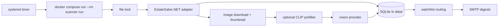

# Estate Sale Finder

Estate Sale Finder is a single-process Python batch application for a Linux home server.
Each Wednesday, it finds applicable EstateSales.NET sales near ZIP `14221`.
An applicable sale overlaps the Thursday-to-Monday sale window.
The application examines new sale photos for approved targets.
It stores all state in SQLite and sends email only for new positive detections.

The application uses one or more watchlists.
Each watchlist has an ID, a name, recipient email addresses, target categories, and email options.
The scanner analyzes each image one time for all active target categories.
It sends each detection only to watchlists that include the detected category.

The approved target categories are:

- `golf_clubs`
- `golf_bag`
- `golf_balls`
- `modern_camera`
- `modern_camera_lens`
- `collectible_perfume_bottle`
- `jewelry`


```mermaid
flowchart LR
  Timer[systemd timer] --> Docker[docker compose run --rm scanner run]
  Docker --> Lock[file lock]
  Lock --> ES[EstateSales.NET adapter]
  ES --> DB[(SQLite in data/)]
  ES --> Images[image download + thumbnail]
  Images --> Prefilter[optional CLIP prefilter]
  Prefilter --> Vision[vision provider]
  Vision --> DB
  DB --> Routing[watchlist routing]
  Routing --> Email[SMTP digests]
```

## EstateSales.NET Assumptions

We verified the ZIP, discovery, and hydration API endpoints with live responses on June 30, 2026.
The discovery endpoint can return sales outside the configured sale window.
Thus, the pipeline filters sale candidates before it receives the sale details.

We did not find a reliable EstateSales.NET API endpoint for the full gallery.
The application uses a tested public HTML parser to get `picturescdn.estatesales.net/<sale_id>/...` gallery URLs.
The parser gives a `GalleryUnavailableError` if the sale page does not contain gallery data.
The application does not make sequential image URLs.
It does not bypass authentication, CAPTCHA, or access controls.

## Local Setup

```bash
python3.12 -m venv .venv
. .venv/bin/activate
pip install -e '.[dev]'
cp .env.example .env
estate-sale-finder migrate
estate-sale-finder doctor
estate-sale-finder run --dry-run
```

If `uv` is available, use these commands:

```bash
uv sync --extra dev
uv run estate-sale-finder run --dry-run
```

## Configuration

The application reads configuration from environment variables and the `.env` file.
These are the important default values:

- `POSTAL_CODE=14221`
- `SEARCH_RADIUS_MILES=35`
- `SALE_WINDOW_MODE=upcoming_weekend`
- `SALE_TIMEZONE=America/New_York`
- `LOOKAHEAD_DAYS=15` when `SALE_WINDOW_MODE=rolling`
- `MIN_PICTURE_COUNT=5`
- `ALLOWED_SALE_TYPES=EstateSales,MovingSales`
- `DATA_DIR=/app/data` in Docker
- `ANALYSIS_VERSION=multi-watchlist-v1`
- `PROMPT_VERSION=targets-multi-v1`
- `ANALYSIS_PROVIDER=mock` until you configure OpenAI credentials
- `EMAIL_ENABLED=false` until you configure SMTP

To use the hosted vision provider, set these variables:

- `ANALYSIS_PROVIDER=openai`
- `VISION_API_KEY`
- `VISION_MODEL`

SMTP uses these shared sender variables:

- `SMTP_HOST`
- `SMTP_PORT`
- `SMTP_USERNAME`
- `SMTP_PASSWORD`
- `SMTP_USE_TLS`
- `EMAIL_FROM`

The default `upcoming_weekend` window starts Thursday at 00:00 and stops Monday at 00:00.
The application calculates this window in `SALE_TIMEZONE`.
A delayed run on Thursday, Friday, Saturday, or Sunday uses the current weekend.
Use `SALE_WINDOW_MODE=rolling` only if you need a rolling `LOOKAHEAD_DAYS` window.
Make sure that `SALE_TIMEZONE` agrees with the configured postal code.

Use JSON to configure production watchlists:

```bash
WATCHLIST_CONFIG_PATH=/app/config/watchlists.json
```

Example:

```json
{
  "watchlists": [
    {
      "id": "golf_camera",
      "name": "Golf and Camera Finds",
      "recipients": ["user@example.com"],
      "targets": [
        "golf_clubs",
        "golf_bag",
        "golf_balls",
        "modern_camera",
        "modern_camera_lens"
      ],
      "send_on_no_matches": false
    },
    {
      "id": "perfume_jewelry",
      "name": "Perfume and Jewelry Finds",
      "recipients": ["other@example.com"],
      "targets": ["collectible_perfume_bottle", "jewelry"],
      "send_on_no_matches": false
    }
  ]
}
```

If you set `WATCHLIST_CONFIG_PATH`, the application uses only that file.
If you do not set it, the application uses the legacy `EMAIL_TO` value.
It also uses the default `golf_camera` watchlist with the original golf and camera categories.
Keep recipient email addresses private in the server configuration.

The vision provider uses batch image references such as `img_0001`.
It does not use database IDs.
These variables control retries:

- `VISION_BATCH_SIZE=4`
- `VISION_MAX_BATCH_ATTEMPTS=2`
- `VISION_MAX_SINGLE_IMAGE_ATTEMPTS=2`
- `VISION_RETRY_BACKOFF_SECONDS=1`

For provider mapping problems, set `VISION_BATCH_SIZE=1` for a short time.
For normal production operation, use a larger batch size when applicable.

Use `VISION_MAX_IMAGES_PER_RUN` to limit paid calls during fault analysis or pending-image work.
For example, `VISION_MAX_IMAGES_PER_RUN=5` limits one run to five applicable images.
The application leaves other images for a later idempotent run.
For no limit, leave the value empty.

Set `OPENAI_SAVE_RESPONSES=true` to save raw OpenAI response files.
By default, the application saves these files in `DATA_DIR/logs/openai-responses`.
Use `OPENAI_RESPONSE_LOG_DIR` to select a different directory.
The files contain image references, status codes, request IDs, response bodies, and error bodies.
They do not contain the API key or the base64 image request.

On the server, restrict access to `.env`:

```bash
chmod 600 .env
```

## Commands

```bash
estate-sale-finder run
estate-sale-finder run --dry-run
estate-sale-finder run --reanalyze
estate-sale-finder run --reanalyze-version-mismatch
estate-sale-finder run --reanalyze-active
estate-sale-finder run --watchlist perfume_jewelry
estate-sale-finder backfill-watchlist perfume_jewelry --active-only
estate-sale-finder watchlists validate
estate-sale-finder watchlists list
estate-sale-finder run --sale-id 4975674
estate-sale-finder doctor
estate-sale-finder migrate
estate-sale-finder test-email
estate-sale-finder inspect-sale 4975674
```

## Deduplication and New Analysis

The unique key for a sale is `source + external_id`.
The unique key for an image is `sale_id + source_url`.
After an image download, the application stores its SHA-256 hash and perceptual hash.

The application refreshes a sale after a change to `pictureCount`, `utcDateModified`, or `latestPicturesAddedCount`.
It tries the gallery again after a failed or incomplete gallery scan.
The application stores sales that have fewer pictures than `MIN_PICTURE_COUNT`.
It examines these sales again during later discovery runs.

An ordinary run uses only the sale IDs that are applicable to the current sale window.
This rule applies to gallery refresh, image download, vision analysis, and notification selection.
SQLite keeps historical rows for the idempotency record and the audit record.
A later weekend run does not process old queued images or detections.

The `--sale-id`, `--reanalyze`, and version-mismatch commands are maintenance commands.
These commands can select work outside the usual sale window.

The scanner analyzes an image only when one of these conditions is true:

- The scanner did not analyze the image before.
- You use `--reanalyze`.
- You use a version-mismatch option after a change to `ANALYSIS_VERSION`.

A normal start does not analyze old images after an analysis-version change.
After you add a watchlist such as `perfume_jewelry`, use this command:

```bash
estate-sale-finder backfill-watchlist perfume_jewelry --active-only
```

This command does a normal scan.
Then, it analyzes active sale images that do not have the current analysis version.
This action checks applicable images for the new categories.
It does not process the complete historical database.

Database records contain the provider, model, prompt version, and analysis version.

After a successful SMTP operation, the application adds a record to `detection_notifications`.
The unique key contains the detection ID, watchlist ID, and recipient email address.
A failed email for one recipient does not change the detections for a different recipient.
The application can send one detection to each watchlist that contains the category.
The application keeps `detections.included_in_email` only for migration compatibility.

The process lock prevents runs at the same time.
If a stopped process has a `running` record, the next run changes that record to `failed`.

## Local Prefilter

The default value of `LOCAL_PREFILTER_ENABLED` is `false`.
The production Docker image contains the `prefilter` dependencies, `torch` and `open-clip-torch`.
When enabled, the prefilter runs on the home server.
The application loads the model when the prefilter first needs it.
It stores model files under `XDG_CACHE_HOME`.
In Docker, this directory is `/app/model-cache`.

The prefilter threshold favors recall.
Use the stored database scores to adjust this threshold.

Each run writes a `local_prefilter_complete` log with these counters:

- `images_prefiltered`
- `images_prefilter_passed`
- `images_prefilter_rejected`

The final `run_complete` log also contains these counters:

- `vision_batches_sent`
- `vision_batches_succeeded`
- `vision_batches_failed`
- `vision_batches_attempted`
- `vision_batches_retried`
- `vision_batch_mapping_failures`
- `images_retried_individually`
- `images_analysis_succeeded`
- `images_analysis_failed`

The local prefilter uses concepts for golf and camera targets.
It also uses concepts for collectible perfume bottles and jewelry.
The local prefilter is not the final classifier.

When `ANALYSIS_PROVIDER=openai`, the OpenAI provider writes these events:

- `openai_vision_request_sent`
- `openai_vision_request_succeeded`
- `openai_vision_request_failed`

A successful request log contains the HTTP status code.
It also contains the OpenAI request ID when the API supplies one.

### Vision Response Mapping Failures

For each thumbnail, the vision batch supplies one fixed `image_ref`.
The provider must return exactly one result for each supplied reference.
The pipeline rejects missing, unexpected, duplicate, and extra references.
The pipeline does not map multi-image results by position.
Positional mapping can attach a detection to the incorrect image.

For a mapping failure, the run writes `vision_batch_mapping_failed`.
For a provider failure, the run writes `vision_batch_provider_failed`.
These logs can contain this information:

- Provider
- Model
- Batch size
- Expected references
- Returned references, if available
- Missing references
- Unexpected references
- Duplicate references
- Image IDs
- Sale IDs
- Attempt number
- Retry method

The logs do not contain API keys, authorization headers, SMTP credentials, base64 image data, or binary image data.

The retry limits prevent unlimited retries.
The pipeline tries a failed batch no more than `VISION_MAX_BATCH_ATTEMPTS` times.
If a multi-image batch still fails, the pipeline tries each image separately.
It tries each image no more than `VISION_MAX_SINGLE_IMAGE_ATTEMPTS` times.

The pipeline gives one malformed image the `failed` status and a short error message.
A later run can try this image again.
The pipeline stores successful images from the same batch.
The next idempotent run does not analyze these successful images again.

The pipeline can correct one incorrect or missing reference in a single-image response.
It makes this correction only when the result is clear.
It then writes the `vision_single_result_ref_corrected` log.

For repeated provider errors, set `VISION_BATCH_SIZE=1` for a short time.
Use this value only for fault analysis.
Normal production operation does not require this value.

A nonzero `images_analysis_failed` value shows partial success in the run summary.
The CLI returns `0` for an isolated provider image failure.
The CLI returns a nonzero value for other fatal failures.

## Testing

Normal tests do not call EstateSales.NET, SMTP, OpenAI, or paid services.
Run these checks:

```bash
ruff format --check .
ruff check .
mypy src
pytest
```

Add a live smoke test only when an environment flag controls it.

## Docker

Build the local image.
Then, run the application:

```bash
docker build -t estate-sale-finder:local .
docker compose run --rm scanner run
```

Run the published image:

```bash
docker run --rm --env-file .env -v "$PWD/data:/app/data" -v "$PWD/model-cache:/app/model-cache" -v "$PWD/config:/app/config:ro" ghcr.io/tohutson/estate-sale-finder:latest run
```

The image uses a non-root user.
It stores runtime state only in `/app/data` and `/app/model-cache`.
The container mounts the watchlist configuration as read-only data at `/app/config`.

## GHCR Publishing

GitHub Actions does these tasks:

- Runs Ruff
- Runs mypy
- Runs the tests
- Builds the image with Buildx
- Pushes these image tags:

- `ghcr.io/tohutson/estate-sale-finder:latest`
- `ghcr.io/tohutson/estate-sale-finder:<commit-sha>`
- Semantic version tags such as `v1.2.3`

For a private GHCR package, enter the GHCR credentials on the server:

```bash
echo "$GHCR_READ_TOKEN" | docker login ghcr.io -u tohutson --password-stdin
```

Use a token that has only package read permission.

## Linux Server Deployment

Install Docker Engine and the Compose plugin from the official apt repository:

```bash
sudo apt-get update
sudo apt-get install -y ca-certificates curl
sudo install -m 0755 -d /etc/apt/keyrings
sudo curl -fsSL https://download.docker.com/linux/ubuntu/gpg -o /etc/apt/keyrings/docker.asc
sudo chmod a+r /etc/apt/keyrings/docker.asc
echo "deb [arch=$(dpkg --print-architecture) signed-by=/etc/apt/keyrings/docker.asc] https://download.docker.com/linux/ubuntu $(. /etc/os-release && echo "$VERSION_CODENAME") stable" | sudo tee /etc/apt/sources.list.d/docker.list >/dev/null
sudo apt-get update
sudo apt-get install -y docker-ce docker-ce-cli containerd.io docker-buildx-plugin docker-compose-plugin
sudo systemctl enable --now docker
```

Create the application directories.
Then, copy the configuration files:

```bash
sudo mkdir -p /opt/estate-sale-finder
sudo mkdir -p /opt/estate-sale-finder/data /opt/estate-sale-finder/model-cache /opt/estate-sale-finder/config
sudo cp compose.yaml /opt/estate-sale-finder/
sudo cp .env.example /opt/estate-sale-finder/.env
sudo cp examples/watchlists.json /opt/estate-sale-finder/config/watchlists.json
sudo chmod 600 /opt/estate-sale-finder/.env
sudo chown -R "$USER":"$USER" /opt/estate-sale-finder
```

Edit `/opt/estate-sale-finder/.env`.
Add the server ZIP code, sale-window settings, OpenAI settings, SMTP settings, and `WATCHLIST_CONFIG_PATH=/app/config/watchlists.json`.
Edit `/opt/estate-sale-finder/config/watchlists.json`.
Add the private recipient email addresses.
Keep runtime secrets only in the server `.env` file.
Keep the watchlist configuration private because it contains recipient addresses and options.

For a private GHCR package, enter a read-only package token:

```bash
echo "$GHCR_READ_TOKEN" | docker login ghcr.io -u tohutson --password-stdin
```

Prepare and start the application:

```bash
cd /opt/estate-sale-finder
docker compose pull scanner
docker compose run --rm scanner migrate
docker compose run --rm scanner doctor
docker compose run --rm scanner watchlists validate
docker compose run --rm scanner test-email
docker compose run --rm scanner backfill-watchlist perfume_jewelry --active-only
docker compose run --rm scanner run
```

Install and enable the timers:

```bash
sudo cp deploy/systemd/*.service deploy/systemd/*.timer /etc/systemd/system/
sudo systemctl daemon-reload
sudo systemctl enable --now estate-sale-image-pull.timer
sudo systemctl enable --now estate-sale-scanner.timer
```

The container image timer downloads a new image each hour.
The scanner timer starts each Wednesday at 09:00 local time.
The scanner timer uses `Persistent=true`.
Thus, a missed run starts after the server starts again.

The default sale window includes sales from Thursday through Sunday in `SALE_TIMEZONE`.
Use one scanner timer.
Do not make a timer for each recipient.

Start a manual server run:

```bash
cd /opt/estate-sale-finder
docker compose run --rm scanner run
```

Show the timers and logs:

```bash
systemctl list-timers 'estate-sale-*'
journalctl -u estate-sale-scanner.service -n 200 --no-pager
journalctl -u estate-sale-image-pull.service -n 100 --no-pager
```

Return to a known commit-SHA image:

```bash
cd /opt/estate-sale-finder
sed -i 's|ghcr.io/tohutson/estate-sale-finder:.*|ghcr.io/tohutson/estate-sale-finder:sha-<commit-sha>|' compose.yaml
docker compose pull scanner
docker compose run --rm scanner doctor
```

### Update an Existing Server

After GitHub Actions publishes the `main` image, do these steps:

1. Make a backup of `/opt/estate-sale-finder/data`.
2. Edit `/opt/estate-sale-finder/.env`.
3. Set `SALE_WINDOW_MODE=upcoming_weekend`.
4. Set `SALE_TIMEZONE` to the time zone of the configured postal code.
5. Run these commands:

```bash
cd /opt/estate-sale-finder
docker compose pull scanner
docker compose run --rm scanner migrate
docker compose run --rm scanner doctor
docker compose run --rm scanner watchlists validate
docker compose run --rm scanner run --dry-run
```

If the dry run is correct, start a normal run:

```bash
docker compose run --rm scanner run
```

Then, make sure that the timers are active:

```bash
systemctl list-timers 'estate-sale-*'
```

## Backups

Stop all active runs.
Then, make the backup:

```bash
sqlite3 data/estate-sale-finder.db '.backup backup/estate-sale-finder.db'
rsync -a data/thumbnails/ backup/thumbnails/
```

The SQLite database contains run state and deduplication data.
Historical email records require the thumbnails.

Restore the backup:

```bash
cp backup/estate-sale-finder.db data/estate-sale-finder.db
rsync -a backup/thumbnails/ data/thumbnails/
docker compose run --rm scanner doctor
```

## Troubleshooting

- **`doctor` cannot find the ZIP code:** EstateSales.NET can change or block the endpoint. Check outbound HTTPS and the adapter tests.
- **The gallery is not available:** Save the current sale-page HTML in `tests/fixtures/`. Update `extract_gallery_from_html`. Then, run the parser tests.
- **Watchlist validation fails:** Run `estate-sale-finder watchlists validate`. Make sure that IDs are unique and that email addresses are valid.
- **Watchlist validation fails:** Make sure that each target is in the approved category list. Active watchlists must have recipients when email is enabled.
- **The application sends no email:** Make sure that `EMAIL_ENABLED=true`. Check SMTP settings, watchlist recipients, and the server SMTP policy.
- **Detections occur again:** Examine `detection_notifications`. If an SMTP operation fails, the application does not mark the applicable detections as sent.
- **The first prefilter run is slow:** The application downloads model files to `model-cache`. Make sure that the container user can write to this directory.

## Watchlist Migration Steps

On an existing server, do these steps:

1. Create `/opt/estate-sale-finder/config`.
2. Copy `examples/watchlists.json` to `/opt/estate-sale-finder/config/watchlists.json`.
3. Set `WATCHLIST_CONFIG_PATH=/app/config/watchlists.json` in `/opt/estate-sale-finder/.env`.
4. In `compose.yaml`, mount `./config:/app/config:ro`.
5. Get the new GHCR image.
6. Run `docker compose run --rm scanner migrate`.
7. Run `docker compose run --rm scanner doctor`.
8. Run `docker compose run --rm scanner watchlists validate`.
9. Run `docker compose run --rm scanner backfill-watchlist perfume_jewelry --active-only`.
10. Enable `estate-sale-scanner.timer`.

## Security and Compliance

The application needs outbound HTTPS access to EstateSales.NET, image CDNs, and GHCR.
It also needs outbound HTTPS access to OpenAI when you enable that provider.
The application does not need inbound webhooks or SSH access from GitHub.
It does not mount the Docker socket.
It does not store secrets in the image.

EstateSales.NET does not document these APIs and can change them.
Read the EstateSales.NET terms.
Make sure that you accept the usage risk before you depend on the scanner.

## Documentation Standard

Use [ASD-STE100 Issue 9](https://www.asd-ste100.org/assets/files/ASD-STE100_ISSUE9.pdf) for user documentation.
Treat code identifiers, product names, and project terms as technical nouns.
Do not change commands, paths, API names, or configuration names to approved dictionary words.
